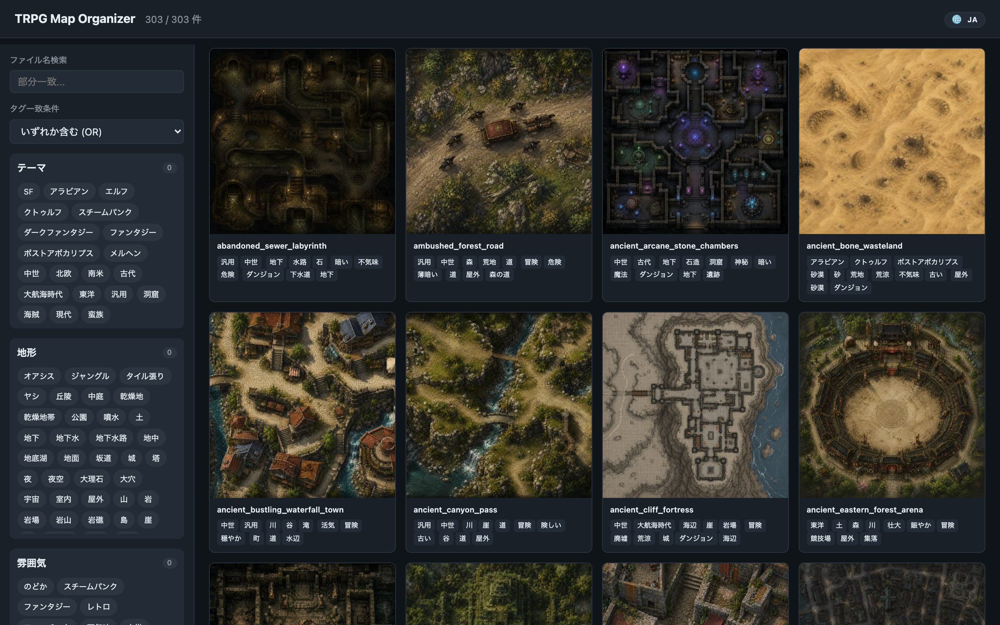
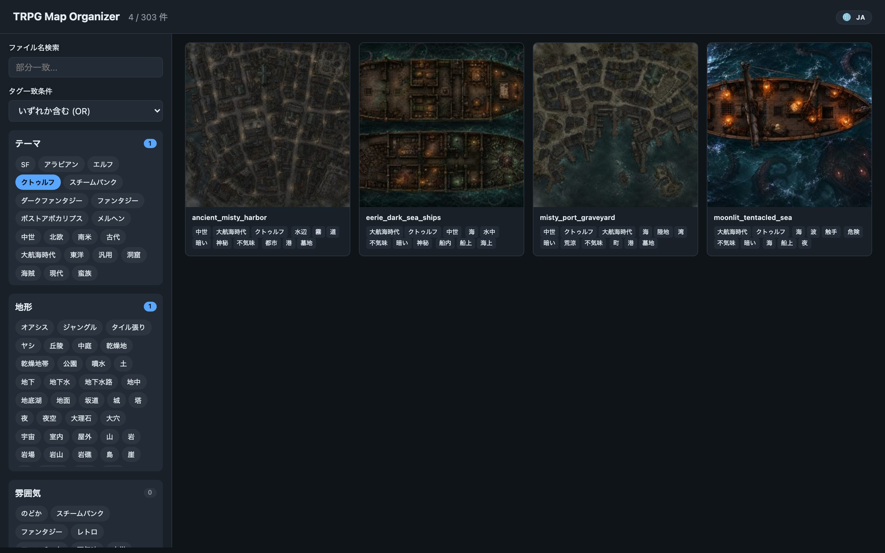
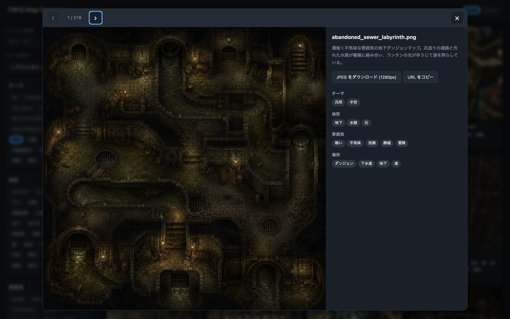
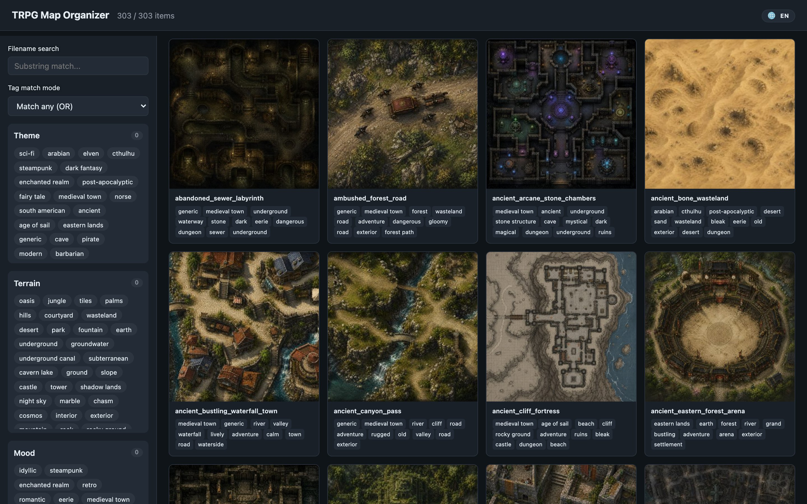
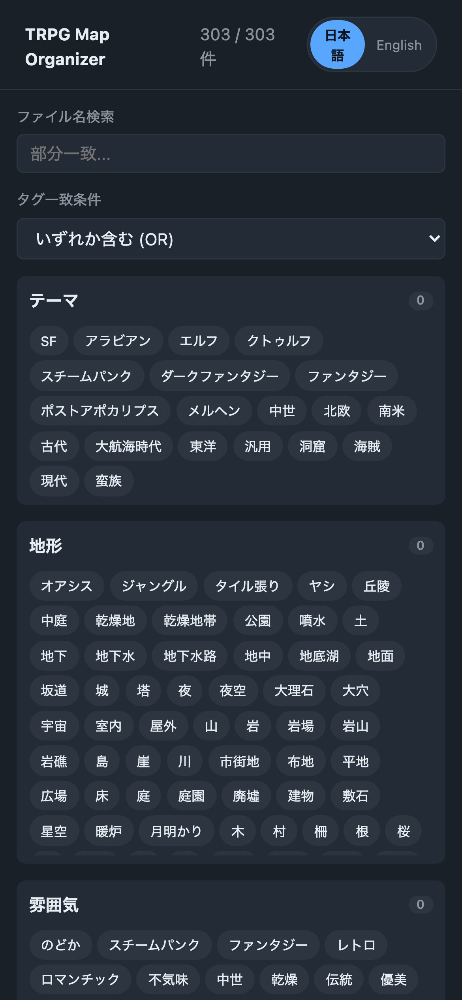
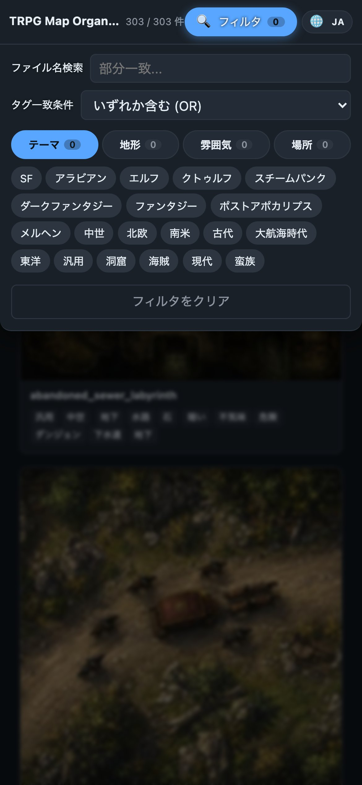
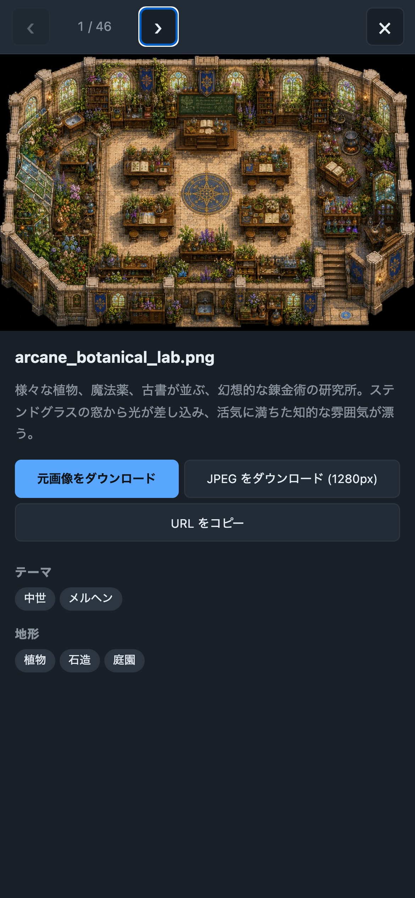

# 🗺️ TRPG Map Organizer

> ローカルに溜まった TRPG 用マップ画像を、AI に自動でタグ付けさせて検索・閲覧できるツール

**[▶︎ Live Demo (GitHub Pages)](https://yamadar.github.io/trpg-map-organizer/)**



TRPG のゲームマスターをやっていると、ネットや AI 生成で集めたマップ画像が
何百枚もフォルダに散らばってしまいがちです。ファイル名はランダムなハッシュ、
中身は開いてみるまでわからない…。

このツールは、**Google Gemini 2.5 Flash** にマップ画像を解析させて
「テーマ / 地形 / 雰囲気 / 場所」の 4 軸でタグ付けし、ファイル名も内容を表す
英語 (`mystical_forest_ruins.png` のような) に自動でリネームします。

タグ付けされたマップは:

- **Streamlit** のローカル WebUI で検索・閲覧
- **静的 HTML** をエクスポートして GitHub Pages で公開

の両方ができます。

---

## ✨ 特徴

- 🤖 **AI 自動タグ付け** — Gemini が画像を解析し、4 カテゴリーで日本語タグを抽出
- 🎭 **テーマ判定** — 中世 / 東洋 / アラビアン / クトゥルフ / メルヘン / 大航海時代 / 汎用…など、TRPG 世界観で分類
- 📝 **英語名リネーム + WebP 化** — タグ情報から雰囲気の伝わる英語ファイル名を自動生成し、WebP に変換 (元 PNG から平均 85% サイズ削減)
- 🔁 **タグ表記揺れの自動統合** — `森林 / 樹林 / 林` → `森` のように同義語を辞書で一元化
- 🌐 **多言語対応** — ブラウザ言語で自動的に日本語 / 英語切替、UI もタグも翻訳
- 🔍 **高度な検索** — 4 軸タグの multi-select × AND/OR + ファイル名部分一致
- 🖼️ **プレビュー機能** — 元画像/JPEG ダウンロード、URL コピー、Prev/Next ナビ、画像プリフェッチで瞬時切替
- 🔗 **画像ごとに固有 URL** — `#g=クトゥルフ&id=42` のようにフィルタ条件付きで個別マップへのディープリンクが可能
- 📱 **モバイル最適化** — トップバーに「フィルタ」トグル、サイドバーは折り畳み可能 (初期はテーマのみ展開)、スワイプで前後遷移
- 🚀 **GitHub Pages 公開** — 静的サイトを 1 コマンドで生成

---

## 📸 スクリーンショット

| デスクトップ (JA) | テーマフィルタ |
|---|---|
|  |  |

| プレビューモーダル | 英語 UI |
|---|---|
|  |  |

<details>
<summary>モバイル表示</summary>

| グリッド | フィルタ展開 | プレビュー |
|---|---|---|
|  |  |  |

モバイル時はトップバーに「フィルタ (N)」ボタンが表示され、タップでサイドバーが
シート風に降りてきます。**テーマ** のみ初期展開で、地形/雰囲気/場所は折り畳まれて
省スペース。

</details>

---

## 🛠️ 必要なもの

- Python 3.10 以上
- [Google AI Studio](https://aistudio.google.com/apikey) の API キー（無料枠あり、有料 Tier 1 なら 1000 RPM）

---

## 🚀 Quick Start

```bash
# 1. リポジトリを取得
git clone https://github.com/yamadar/trpg-map-organizer.git
cd trpg-map-organizer

# 2. 仮想環境と依存
python3 -m venv .venv
source .venv/bin/activate
pip install -r requirements.txt

# 3. 設定ファイル
cp .env.example .env                    # GEMINI_API_KEY=... を編集
cp config.example.yaml config.yaml      # target_folder を編集

# 4. マップ画像を target_folder に置いて、解析実行
python -m scripts.build_db              # 並列で全件解析 (10 worker 推奨)

# 5. ローカル WebUI で確認
streamlit run src/app.py
# → http://localhost:8501
```

設定ファイルの主な項目:

```yaml
# config.yaml
target_folder: "./maps"          # 解析する画像フォルダ
database_path: "./data/maps.db"  # SQLite の保存先
gemini_model: "gemini-2.5-flash" # 使用モデル
api_workers: 10                  # 並列ワーカ (無料枠は 1、Tier 1+ は 10-20)
api_min_interval_sec: 0          # 連続呼び出しの最小間隔秒 (無料枠は 15)
```

---

## 📚 主なワークフロー

### 1. 画像を追加して解析
```bash
python -m scripts.build_db                # 増分解析 (未解析のみ)
python -m scripts.build_db --rebuild      # 全件再解析
python -m scripts.build_db --workers 10   # 並列ワーカ数を上書き
```

### 2. 英語ファイル名へリネーム (+ WebP 変換)
```bash
python -m scripts.rename_to_english --only-hash   # ハッシュ名のみ対象
python -m scripts.rename_to_english               # 全件対象
python -m scripts.rename_to_english --keep-format # WebP 変換せず元形式を保持
```
タグと description から `mystical_forest_ruins.webp` のような名前を生成し、
リネームと同時に **PNG/JPG を WebP (Quality=85, Effort=4) に変換** する。
DB の `file_path` / `file_name` も同時更新。`--keep-format` を付けると変換せず
元の拡張子を保持する。

### 3. タグ表記揺れの正規化
```bash
# (a) Gemini に統合候補を出させる
python -m scripts.suggest_aliases
# → tag_aliases_suggested.yaml が生成される (要レビュー)

# (b) 内容を確認のうえ採用するものを tag_aliases.yaml にマージ

# (c) DB に適用 (API 呼ばず、書き換えのみ)
python -m scripts.normalize_db --dry-run
python -m scripts.normalize_db
```

### 4. テーマ (世界観) の埋め直し
新しいテーマカテゴリを追加した場合や、theme_tags が空のレコードを補完する場合:
```bash
python -m scripts.analyze_themes          # 空のものだけ再解析
python -m scripts.analyze_themes --rebuild # 全件再解析
```

### 5. 英訳辞書の更新
```bash
python -m scripts.translate_tags          # 未翻訳のタグだけ Gemini で英訳
```

### 5b. 既存画像の一括 WebP 化 (移行用)
```bash
python -m scripts.convert_to_webp                       # 既定 Q=85, E=4
python -m scripts.convert_to_webp --quality 90 --effort 6  # より高品質/高圧縮
python -m scripts.convert_to_webp --only maps           # maps/ のみ
python -m scripts.convert_to_webp --only docs           # docs/originals/ のみ
python -m scripts.convert_to_webp --dry-run             # 計画のみ表示
```
`maps/*.png` と `docs/originals/*.png` (+ `.jpg`) を `.webp` に変換し、
DB の `file_path` / `file_name` / `file_size` / `file_mtime` / `file_hash`
も同期する。既に新規追加分は `rename_to_english` が自動で WebP 化するため、
このスクリプトは旧データの一括移行用。

### 6. 静的サイトを生成して GitHub Pages へ
```bash
python -m scripts.export_static                 # docs/ に全生成 (約 310 MB)
python -m scripts.export_static --no-originals  # 元画像コピーを省く (約 150 MB)
python -m scripts.export_static --no-images     # JSON/HTML のみ更新

# ローカル確認
python -m http.server -d docs 8080
# → http://localhost:8080

# 公開
git push origin main
# GitHub Settings → Pages → Source: main / /docs
```
生成される `docs/` は以下の構成:
- `docs/images/thumb/*.jpg` (400px JPEG, 約 14 MB) — グリッド表示用
- `docs/originals/*.webp` (元解像度 WebP, 約 170 MB) — プレビュー / ダウンロード用

元解像度 WebP は十分軽量なため、中間サイズの JPEG (旧 `images/mid/`) は廃止して
プレビューにも `originals/` を直接使う構成にした。

### 7. 一連の処理を順番に実行 (新規画像追加時)
```bash
# 1. maps/before_process/ に画像を投入したら:
python -m scripts.build_db          # AI 解析
python -m scripts.rename_to_english --only-hash  # 英語名 + WebP 化
python -m scripts.normalize_db      # タグ正規化
python -m scripts.translate_tags    # 新タグ英訳
python -m scripts.export_static     # 静的サイト再生成
```

---

## 🏗️ アーキテクチャ

```
画像ファイル                ┌──────────────────────┐
   │                       │  Gemini 2.5 Flash    │
   │  scripts/build_db.py  │  (multimodal API)    │
   └─────────► 並列解析 ◄──┤   - 4 カテゴリ抽出   │
                  │        │   - 説明文生成        │
                  ▼        └──────────────────────┘
       ┌──────────────────┐
       │   tag_aliases    │  variant → canonical の表記揺れ統合
       │   normalize      │
       └──────┬───────────┘
              ▼
       ┌──────────────────┐
       │  SQLite (maps.db)│  file_path / file_name / 4 tags / desc / mtime ...
       └──────┬───────────┘
              │
        ┌─────┴──────┐
        ▼            ▼
 ┌──────────────┐ ┌─────────────────────┐
 │  Streamlit   │ │  scripts/           │
 │  WebUI       │ │  export_static.py   │
 │ (ローカル)    │ │ → docs/ (バニラ JS) │
 └──────────────┘ └──────────┬──────────┘
                             ▼
                     ┌────────────────┐
                     │ GitHub Pages   │
                     │ で静的公開      │
                     └────────────────┘
```

### データベース

`maps` テーブル:

| カラム | 型 | 用途 |
|---|---|---|
| `id` | INTEGER PK | 自動採番 |
| `file_path` | TEXT UNIQUE | target_folder からの相対パス (POSIX) |
| `file_name` | TEXT | ファイル名のみ |
| `file_size`, `file_mtime`, `file_hash` | — | 変更検出用メタ |
| `theme_tags` | JSON | 世界観タグ |
| `terrain_tags` | JSON | 地形タグ |
| `mood_tags` | JSON | 雰囲気タグ |
| `location_tags` | JSON | 場所タグ |
| `description` | TEXT | AI 生成の 80 字程度の説明 |
| `analyzed_at` / `created_at` / `updated_at` | TIMESTAMP | 時刻情報 |

タグは JSON 配列で保存し、検索時は SQLite の JSON1 拡張 (`json_each`) で展開してフィルタする。

---

## 📁 プロジェクト構成

```
trpg-map-organizer/
├── README.md
├── requirements.txt
├── .env.example
├── config.example.yaml
├── tag_aliases.yaml               # タグ正規化辞書 (人間が編集する正本)
├── src/
│   ├── config.py                  # 設定ローダ
│   ├── db.py                      # SQLite 操作
│   ├── scanner.py                 # ファイル走査・変更検出
│   ├── analyzer.py                # Gemini API クライアント (画像 → 4 タグ)
│   ├── normalize.py               # タグ表記揺れの正規化
│   └── app.py                     # Streamlit ローカル UI
├── scripts/
│   ├── build_db.py                # DB 構築 (並列解析)
│   ├── analyze_themes.py          # 既存レコードにテーマだけ追加
│   ├── normalize_db.py            # 既存 DB にエイリアスを適用
│   ├── suggest_aliases.py         # Gemini に統合候補を提案させる
│   ├── translate_tags.py          # タグを英訳して i18n.json を更新
│   ├── rename_to_english.py       # 英語名にリネーム + WebP 変換
│   ├── convert_to_webp.py         # 既存 PNG/JPG を一括 WebP 化 (移行用)
│   ├── migrate_paths.py           # 旧 DB を相対パスへ移行 (一度きり)
│   ├── export_static.py           # 静的サイト生成
│   └── take_screenshots.py        # README 用スクショ撮影
├── web/                           # 静的サイトのテンプレート
│   ├── index.html
│   ├── style.css
│   ├── app.js
│   └── i18n.json                  # UI + タグ翻訳
├── docs/                          # 生成された静的サイト (GH Pages 配信元)
└── screenshots/                   # README 用スクリーンショット
```

---

## 🔧 設計上の判断

- **AI モデル選定**: マルチモーダル対応・構造化 JSON 出力 (`response_schema`) サポート・無料枠あり・コスパ最良の理由で **Gemini 2.5 Flash** を採用。
- **タグの表記揺れ**: AI 出力は表記が安定しないため、`tag_aliases.yaml` で variant → canonical の置換辞書を持ち、挿入時 + 既存 DB 一括更新の両方をサポート。`scripts/suggest_aliases.py` で AI に統合候補を提案させて人間がレビュー。
- **DB のパス**: GitHub Pages へポータブルにするため、`file_path` は `target_folder` からの相対パスで保存。ローカル実行時は `db.resolve_path()` で絶対化。
- **静的サイト**: ビルド工程不要のバニラ JS。`docs/data/maps.json` を fetch して動的にレンダリング。
- **画像形式**: ソース画像は WebP (Quality=85, Effort=4) に統一。`rename_to_english` がリネーム時に自動変換するため、新規 PNG/JPG を投入してもパイプライン通過後は WebP になる。元 PNG (~3MB/枚) から WebP (~0.5MB/枚) で平均 **85% サイズ削減**。
- **画像サイズ**: 元画像 (WebP) を `docs/originals/` にコピーし、グリッド用に 400px JPEG サムネを生成する。プレビュー (モーダル) は `originals/*.webp` を直接表示する (元解像度 WebP が小さいため中間サイズの JPEG は不要)。総容量は 369 枚で約 **185 MB**。`--no-originals` で約 15 MB に抑えられる (プレビューはサムネ画質にフォールバック)。
- **i18n**: ブラウザ `navigator.language` で自動切替。手動切替は `localStorage` に保存。URL ハッシュ内のタグは canonical (日本語) で保持し、表示時に翻訳。

---

## 🐛 トラブルシュート

| 症状 | 対処 |
|---|---|
| `GEMINI_API_KEY が未設定です` | `.env` を作成し API キーを設定 |
| `ターゲットフォルダが存在しません` | `config.yaml` の `target_folder` を確認 |
| 429 Too Many Requests | 無料枠なら `api_workers: 1`, `api_min_interval_sec: 15` に。有料枠 (Tier 1+) なら `api_workers: 10` で快適 |
| 503 Service Unavailable | tenacity で自動リトライ。多発時は時間を置いて再実行 |
| 画像が表示されない | ファイル名が変わっている / 移動されている可能性。`build_db.py` 再実行で更新検出 |

---

## 📄 ライセンス

個人利用を想定したプロジェクト。
